# SAE Image

## Exercice A :

### A.0

Le problème ici était que la taille réelle du fichier ne correspondait pas à celle indiquée dans l'interpréteur hexadécimal. Effectivement, la taille du fichier est indiquée sur 4 octets à partir de l'adresse 00000002 en little-endian. Pour corriger le problème, il faudrait remplacer l'octet qui se trouve à l'adresse 00000002 (qui est `99`) par la valeur `9A`.

### A.1

Voici le code de l'image ainsi que le résultat à côté : 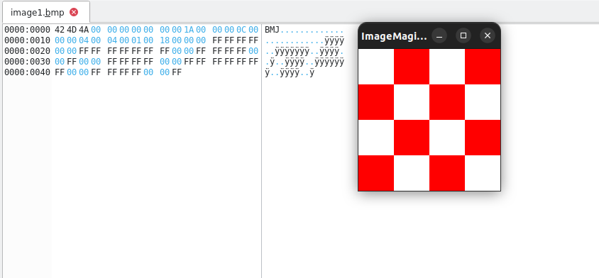 

### A.2 

Ici, l'image modifiée avec son code ouvert dans un interpréteur hexadécimal : 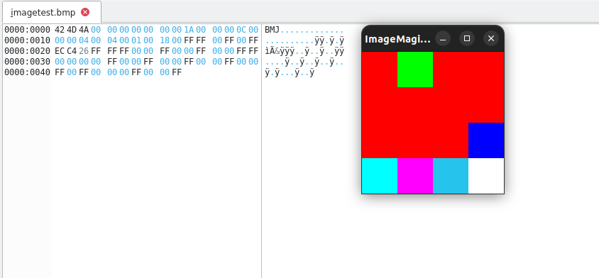

### A.3

#### 1

Il y a 24 bits pour coder une couleur, c'est-à-dire 3 octets.

#### 2

La taille des données pixels est de 48 octets.

#### 3

Il n'y a pas de compression qui a été effectuée.

#### 4

Le codage des pixels n'a pas non plus changé.

### A.4

#### 1

Il y a 16 bits par pixel, soit 2 octets.

#### 2 

La taille des données pixels est de 36 bits, soit 6 octets.

#### 3

Il n'y a pas de compression qui a été effectuée sur un fichier de cette taille. Cependant, sur un fichier plus lourd, le passer en index de couleur le rendra moins lourd.

#### 4

Les couleurs de la palette sont codées comme suit : la première couleur sur 3\*16 bits, puis deux 0, puis la deuxième couleur également sur 3\*16 bits. Enfin, pour terminer l'index de couleur, il y a encore une fois deux 0.

#### 5 

Il y a 2 couleurs dans la palette, du rouge et du blanc.

#### 6

Dans la palette, le rouge correspond à la 1ère couleur de la palette (0) et le blanc à la deuxième (1). On veut donc 0101. Comme il n’y a que 2 couleurs dans la palette, c’est 0101 en binaire. On convertit ensuite 0101 en hexadécimal et on obtient 0050. Comme nous travaillons sur du little-endian, ça sera codé 50 00.

#### 7

Pour faire ceci, j'ai remplacé le codage des pixels qui étaient sensés être rouges en bleu. Voici son code ainsi que l'image : 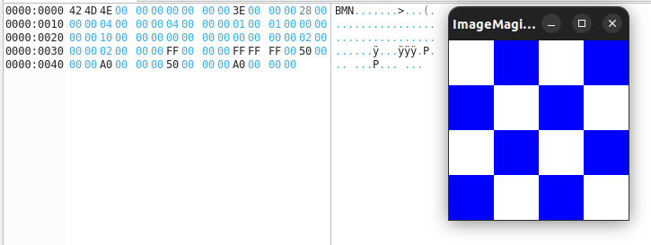

#### 8

Pour faire ceci, j'ai inversé les valeurs A0 et les valeurs 50, ce qui donne ceci : 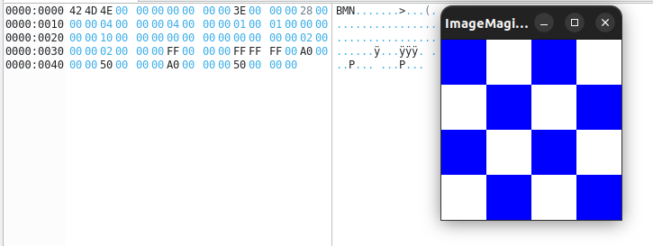

#### 9

Pour faire cette image, j'ai réalisé ce code : 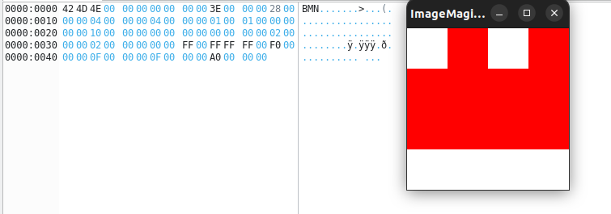

#### 10 

Pour passer l'image en index de couleur, j'ai tapé cette commande :  
`convert ImageExemple.bmp -colors 16 bmp3:ImageExempleIndexBMP3_16.bmp`

#### 11

On peut trouver le nombre de couleurs à l'adresse 14, ici A9.

#### 12

On trouve la couleur dominante à l'adresse 66. La couleur est FD FE FE.

#### 13

Le tableau commence à l'adresse 76.

#### 14

J'ai changé les premières valeurs du tableau par les couleurs bleues :
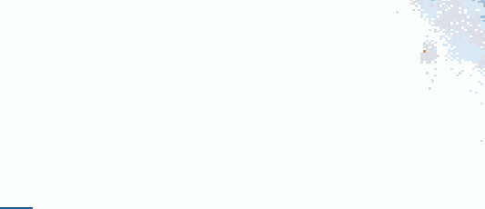
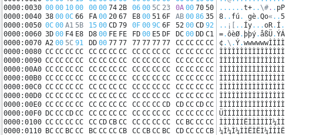

#### 15

Les couleurs changent beaucoup : 
Dans l'hexa, seulement les 4 premières couleurs sont restées les mêmes, mais les couleurs suivantes ont été remplacées par des pixels noirs, ce qui fait que les pixels sont codés avec les premiers éléments de la palette, donc en 1, 2, 3 et 4.

### A.5

#### 1

On reprend l'image 3.

#### 2

Il faut remplacer la hauteur qui est de 4 et la transformer en -4, ce qui fait que la valeur 04 00 00 00 deviendra FC FF FF FF: 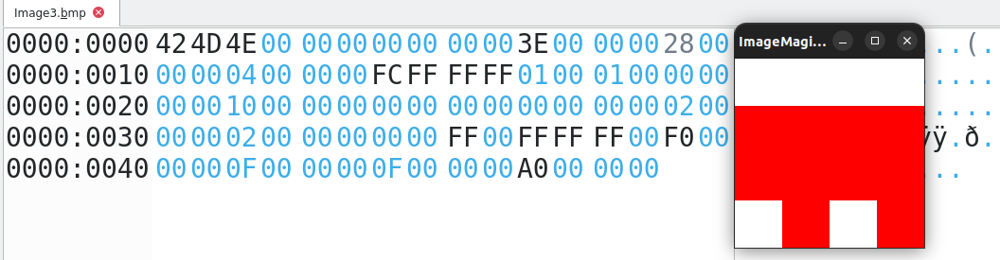

#### 3

J'ai remplacé la valeur 00 00 01 A9 par FF FF FE 57 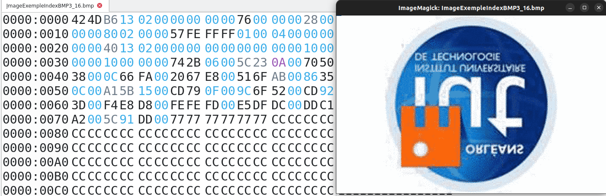

### A.6

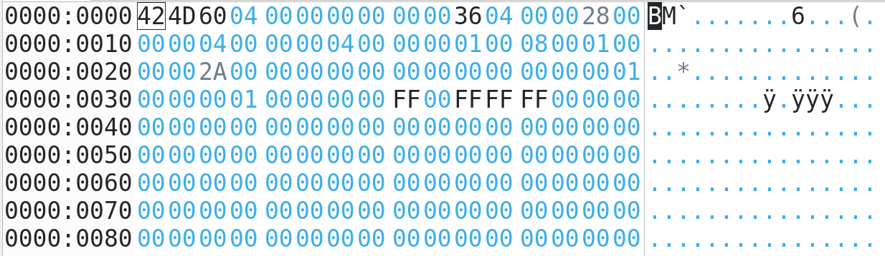

#### 1

La taille du fichier est maintenant de 1120 octets, on le voit à l'adresse 0000 0002, 460 en hexadécimal, ce qui fait 1120 octets. On constate une telle évolution, car ici, dans la palette de couleur, 256 couleurs sont codées, mais les autres emplacements que nous n'utilisons pas sont remplis avec des 00 00 00, ce qui donne du noir.

#### 2

L'information se trouve à l'adresse 0A, l'encodage commence donc à l'adresse 436.

#### 3

- Le premier octet correspond au nombre de pixels qui vont être codés.
- Le second correspond à l'adresse de la palette de couleur à insérer.

### A.7

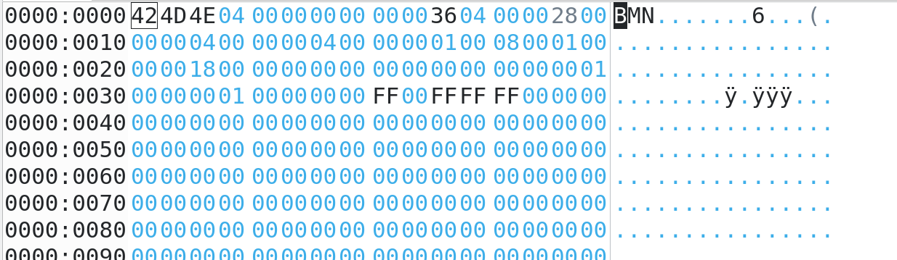

#### 1

Ici, l'image est plus légère car 3 des lignes sont de la même couleur et que la compression RLE se base sur la répétition des lignes. L'image fait 1102 octets.

#### 2

Le codage des pixels est le même que pour la question précédente.

### A.8

On garde la même palette de couleur que précédemment et on modifie les pixels restants : 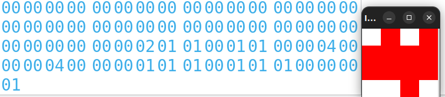

### A.9

On modifie la palette du début : 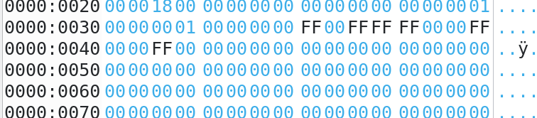
Et on modifie par conséquent le codage des pixels : 

### A.10

On garde la même palette de couleur et on rechange les pixels : 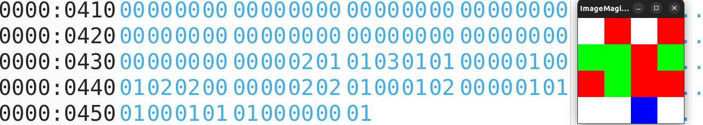

## Exercice B

### B.1

Code pour la transposée [ici](rotation.py). Pour réaliser ce code, j'ai récupéré la valeur en x et y de chaque pixel, et je les ai placées aux coordonnées y et x de l'autre image.

### B.2

Code pour inverser les images [ici](image_mirroir.py). Pour réaliser ce programme, j'ai récupéré chaque pixel et je les ai placés à l'indice largeur de l'image - l'emplacement du pixel de base.

### B.3

Code pour mettre l'image en niveaux de gris [ici](niveaux_gris.py). Pour réaliser ce programme, j'ai récupéré la valeur de chaque pixel et j'ai fait une moyenne des valeurs en R, G et B de chaque pixel, puis j'ai remplacé les valeurs RGB par la couleur que j'avais trouvée grâce à la formule (R+G+B)//3.

### B.4

Code pour passer l'image en noir et blanc [ici](noir_blanc.py). Pour réaliser ce programme, j'ai récupéré la valeur R, G, B de chaque pixel et j'ai vérifié la valeur euclidienne avec le noir et blanc pour savoir si on était au-dessus ou en dessous. Grâce à cette égalité, j'ai obtenu un booléen qui, s'il est vrai, passe le pixel en noir et s'il est faux, met le pixel en blanc.
