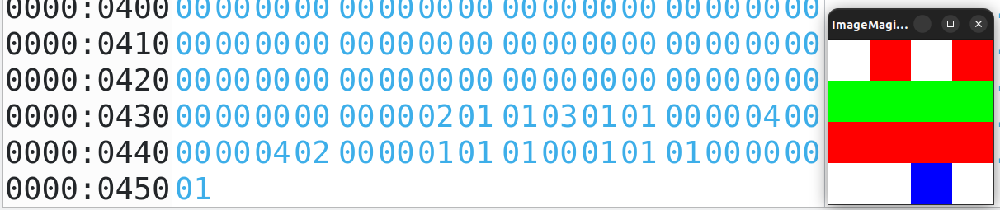

# SAE Image 

## Exercice A :

### A.0
le problème ici était que la taille réelle du fichier ne correspondait pas avec celle indiquée dans l'interpreteur hexadécimal. 
effectivement, la taille du fichier est indiquée sur 4 octets à partir de l'adresse 00000002 en little-endian. pour corriger le problème, il faudrait remplacer l'octet qui se trouve a l'adresse 00000002 qui est `99` par la valeur `9A`

### A.1
voici le code de l'image ainsi que le résultat, à côté :  

### A.2 
ici l'image modifiée, avec son code ouvert dans un interpretteur hexadécimal : 

### A.3
#### 1
il y a 24 bits pour coder une couleur, c'est à dire 3octets.

#### 2
la taille des données pixels est de 48 octets.

#### 3

il n'y a pas de compression qui a été effectuée

#### 4

le codage des pixels n'a pas non plus changé

### A.4

#### 1

il y a 16 bits par pixels, soit 2 octet

#### 2 
la taille des données poixels sont de 36 bits, soit 6 octets

#### 3
il n'y a pas de compression qui a été effectué sur un fichier de cette taille, cepandant, sur un fichier plus lourd, le passer en index de couleur le rendra moins lourd

#### 4
lesz couleurs de la palette sont codées comme suit : la première couleur sur 3\*16 bits, deux 0, puis la deuxième couleur également sur 3\*16 bits et enfin, pour terminer l'index de couleur, il y a encore une fois deux 0

#### 5 
il y a 2 couleurs dans la palette, du rouge et du blanc

#### 6
...

#### 7
pour faire ceci, j'ai remplacé le codage des pixels qui étaient sensés être rouge en bleu. voici son code ainsi que l'image : 

#### 8
Pour faire ceci, j'ai inversé les valeurs A0 et les valeurs 50, ce qui donne ceci : 

#### 9
epour faire cette image, j'ai réalisé ce code : 

#### 10 
pour passer l'image en index de couleur, j'ai tapé cette commande :  
`convert ImageExemple.bmp -colors 16 bmp3:ImageExempleIndexBMP3_16.bmp`

#### 11
on peut trouver le nombres de couleur à l'adresse 14, ici A9

#### 12
on trouve la couleur dominante à l'adresse 66. la couleur est FD FE FE

#### 13
le tableau commence à l'adresse 76

#### 14
j'ai changé les premieres valeurs du tableau par les couleurs bleues :

#### 15
les couleurs changent beaucoup : 
dans l'hexa, seulement les 4 premieres couleurs sont restés les memes, mais les couleurs suivantes ont été remplacés par des pixels noirs, ce qui fait que les pixels sont codés avec les premiers elements de la palette, donc en 1, 2, 3 et 4

### A.5

#### 1
on reprend l'image 3

#### 2
il faut remplacer la hauteur qui est de 4 et la transformer en -4, ce qui fait que la valeur 04 00 00 00 deviendra FC FF FF FF: 

#### 3
j'ai remplacé la valeur 00 00 01 A9 par FF FF FE 57 

### A.6

#### 1
la taille du fichier est maintenant de 1120 octets, on le voit a l'adresse 0000 0002, 460 en hexadecimal qui font 1120 octets. on constate une telle évolution, car ici, dans la palette de couleur, 256 couleurs sont codées, mais les autres emplacement que nous n'utilisons pas sont remplis avec des 00 00 00, qui donne du noir

#### 2
l'information se trouve a l'adress 0A, l'encodage commence donc à l'adresse 436.

#### 3

- le premier octet correspond au nombre de pixels qui va être codé
- le second correspond à l'adresse de la palette de couleur à inserer 

### A.7

#### 1
ici, l'image est plus légere car 3 des lignes sont de la même couleur et que la compression RLE se base sur la repetition des lignes, l'image fait 1102 octets

#### 2
le codage des pixels est le même que pour la question précédente

### A.8
on garde la même palette de couleur que précedemment et on modifie les pixels restants 

### A.9
On modifie la palette du début : 

et on modifie par conséquent le codage des pixels : 

### A.10
on garde la même palette de couleur et on rechange les pixels :

## Exercice B

### B.1

code pour la transposée [ici](rotation.py). Pour réaliser ce code, j'ai récupér la valeur en x et y de chaques pixels, et je les ai placés aux coordonées y et x de l'autre image. 

### B.2

code pour inverser les images [ici](image_mirroir.py). pour réaliser ce programme, j'ai récupéré chaque pixels et je les ait placés à l'indice largeur de l'image - l'emplacement du pixel de base.

### B.3

code pour mettre l'image en niveaux de gris [ici](niveaux_gris.py). Pour réaliser ce programme, j'ai récupéré la valeur ce chaque pixels et j'ai fait une moyenne des valeurs en R,G et B de chaque pixels et j'ai remplacé les valeurs RGB par la couleur que j'avais trouvé grace à la formule (R+G+B)//3

### B.4

code pour passer l'image en noir et blanc [ici](noir_blanc.py). Pour réaliser ce programme, j'ai récupéré la valeur R,G,B de chaque pixels et j'ai verifié la valeur euclidienne avec le noir et blanc pour savoir si on était au dessus ou en dessous. grâce à cette égalité, j'ai eu un booléen qui si il est vrai passe le pixel en noir et si il est faux, met le pixel en blanc

